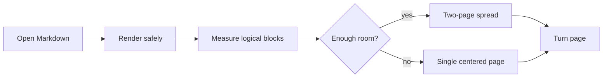

# Eagle Markdown

A quiet native Markdown reader for people who want their notes, docs, drafts, and README files to feel good on a desktop screen.

> [!NOTE]
> This sample file is included so you can test the app's typography, page motion, code blocks, tables, task lists, and live reload behavior in one place.

> A plain blockquote should feel calmer than an alert.
>
> > Nested quotations should still preserve rhythm, indentation, and contrast.

## Reading Surface

The interface now divides one Markdown document into book pages. The first page appears centered, interior pages form a left-and-right spread, and the final page returns to the center when there is no companion page beside it.

### What to Notice

- The document opens on a warm book-like page.
- The right arrow key advances the spread.
- The right-side page becomes the next left-side page as you move forward.
- The UI chrome stays quiet so the document can lead.
- The theme control can follow the system or force light/dark.

## Page Turning

Use the arrow buttons or keyboard:

| Key | Action |
|-----|--------|
| Right Arrow | Move forward one page |
| Left Arrow | Move backward one page |
| Page Down | Move forward one page |
| Page Up | Move backward one page |
| Home | Return to the first page |
| End | Jump to the final page |

The important detail is that navigation moves one page at a time. If page 2 is on the right side of the spread, pressing the right arrow moves page 2 to the left side and brings page 3 into view on the right.

## Markdown Coverage

| Feature | Expected behavior |
|---------|-------------------|
| Headings | Clear hierarchy with hover anchors |
| Tables | Horizontal scrolling when content is wide |
| Code blocks | Language label, syntax highlighting, and copy button |
| Task lists | Native-looking checkboxes |
| External links | Open in your default browser |
| Footnotes | References remain readable without dominating the page |
| ASCII diagrams | Monospace layouts keep their shape |

## Code Block

```ts
type ReadingMode = "focused" | "reviewing" | "shipping";

function describeMode(mode: ReadingMode): string {
  const copy = {
    focused: "The document gets the room.",
    reviewing: "Structure, contrast, and code scanning stay sharp.",
    shipping: "The app is ready for signed public distribution.",
  };

  return copy[mode];
}
```

```rust
fn paginate(blocks: Vec<Block>, page_height: u32) -> Vec<Page> {
    let mut pages = Vec::new();
    let mut current = Page::default();

    for block in blocks {
        if current.height() + block.height() > page_height {
            pages.push(current);
            current = Page::default();
        }
        current.push(block);
    }

    pages.push(current);
    pages
}
```

## Design Notes

Eagle Markdown is deliberately small. It is not trying to be a notes database, a writing suite, or a website builder. Its job is to open local Markdown quickly and make the reading experience feel calm enough for daily use.

The book layout has a few practical rules:

- Wide windows show two pages when there is enough content.
- Narrow windows collapse to a single visible page.
- The first and last pages are centered so the book never feels visually lopsided.
- Content is paginated by rendered blocks, so headings, paragraphs, tables, and code blocks stay intact whenever possible.

> [!TIP]
> Try resizing the window. The app recalculates the document pages so the spread remains balanced for the available space.

> [!CAUTION]
> Wide tables and large diagrams are intentionally difficult for paginated layouts. The app should keep them legible without letting them dominate the whole reading surface.

## ASCII Diagram

```text
┌──────────────────────┐       ┌──────────────────────┐
│ Markdown file (.md)  │       │ User interaction     │
│ - prose              │       │ - arrow keys         │
│ - tables             │       │ - theme switch       │
│ - diagrams           │       │ - drag and drop      │
└──────────┬───────────┘       └──────────┬───────────┘
           │                              │
           ▼                              ▼
┌─────────────────────────────────────────────────────┐
│                  Eagle Markdown                      │
│  Rust parser → sanitized HTML → measured book pages  │
└─────────────────────────────────────────────────────┘
```

## Mermaid-style Diagram Source



## Task List

- [x] Render GitHub-flavored Markdown
- [x] Add a native-feeling reading surface
- [x] Keep the interface single-page, not two-page
- [x] Prepare macOS release guidance
- [ ] Sign and notarize the public macOS build

## Release Notes

For macOS users, the professional release path is Developer ID signing and Apple notarization. That lets Gatekeeper verify the app normally, instead of asking people to bypass system protections.

> [!IMPORTANT]
> If a public macOS release shows an unidentified developer warning, treat that release as incomplete. Fix signing and notarization before sharing it widely.

## Longer Reading Sample

This section exists to make the demo long enough to exercise the spread. Markdown documents often contain a mix of prose, short lists, code, and reference tables. A good reader should keep those pieces legible without making the user constantly fight layout.

When the document is paginated, each rendered block is measured against the current page size. Short paragraphs group together naturally. Larger blocks, like code samples or tables, are kept whole when possible. That means the book effect should feel stable instead of chopping text in strange places.

The reader is meant to feel native to macOS while remaining useful on Windows and Linux. The visual system uses platform fonts, restrained controls, and a quiet palette. The page itself gets the most depth. The chrome stays light.

### A Practical Workflow

1. Open a Markdown document.
2. Read it as a centered first page.
3. Move through the document with the right arrow key.
4. Watch the spread advance one page at a time.
5. Switch between system, light, and dark themes.
6. Edit the file in another editor and save.
7. Confirm the document reloads and repaginates.

### Another Callout

> [!WARNING]
> The local test build is unsigned. That is acceptable while developing, but public macOS releases should be signed and notarized before distribution.

## Reference Table

| Area | Professional expectation | Current demo coverage | Stress signal | Risk if weak |
|------|--------------------------|-----------------------|---------------|--------------|
| App shell | Clear, quiet, native-feeling controls | Header, tabs, theme switcher | Dense controls in a narrow chrome | App feels like a prototype |
| Reader | Document-forward layout | Centered first/last pages and spread view | Long prose and mixed block types | Pagination feels arbitrary |
| Motion | Helpful, not noisy | Page-turn transition | Repeated next/previous navigation | Movement distracts from reading |
| Markdown | Common GitHub features | Tables, alerts, tasks, code, links | Wide tables, nested quotes, diagrams | Content becomes unreadable |
| Distribution | Gatekeeper-friendly release path | Signing checklist and workflow secrets | Release notes and warnings | Users distrust the download |

## Footnotes and Links

Markdown documents often include citations, references, and product links. External links such as [Tauri](https://tauri.app) should open outside the app, while footnotes should stay quiet enough for reading.[^release]

[^release]: Public macOS distribution needs Developer ID signing and Apple notarization. The local build is only for testing.

## Final Page Check

The last page should appear centered when you reach the end of this sample. That creates the bookend effect you described: the beginning and ending feel intentional, while the middle behaves like a two-page spread.

## Live Reload Test

Open this file in Eagle Markdown, edit this sentence in your editor, and save. The app should update the rendered page automatically.
